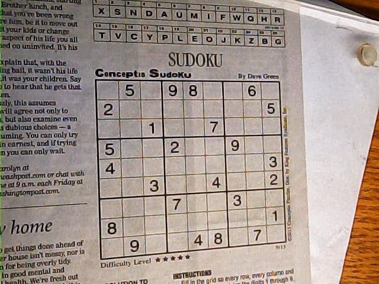

# An Augmented Sudoku Solution Image Generator
 

So my aim was to create a project to solve the sudoku puzzle just using the image of it and Augmenting the solution back to the original Image.

It is a fairly under developed project and contains many glitches.

---

## Technology Used

- Python
- Rust
- Opencv
---
## Working Flow

We are using **Opencv** to Locate the Sudoku block in the image.

</img>
</img>

After getting the cropped image , next job is to *remove the extra noise* and fill the openings if any and get the **number contours**.

</img>

Next is to detect the numbers using our **ML model** and create a *digital copy of the whole sudoku puzzle*

</img>

After getting the digits recognized, we will be using our **Python library Written in Rust** to Solve the Sudoku and get the solution

</img>

Once we have the solution its time to **mask** it over our original image.

</img>

